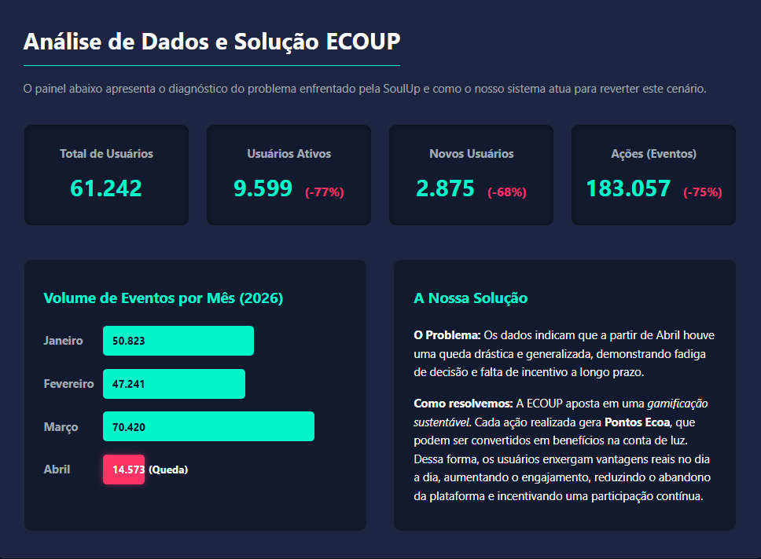
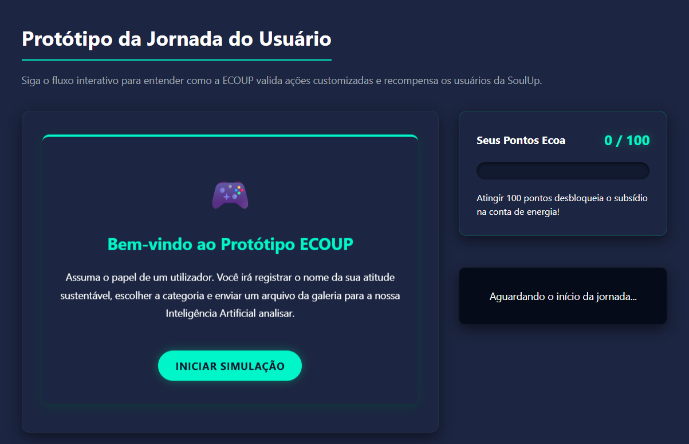
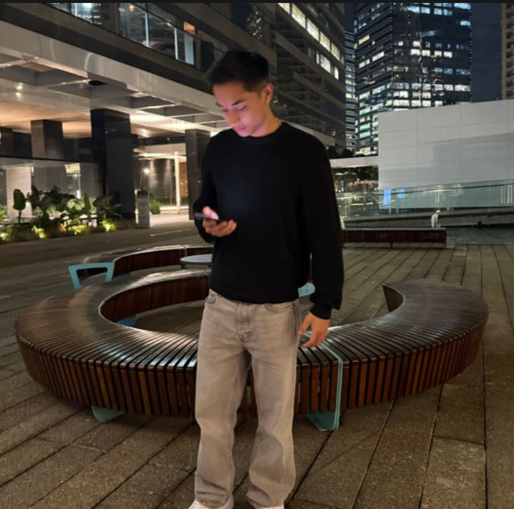

<div align="center">
  
  
  # 🌱 ECOUP - Gamificação Sustentável
  **Transformando atitudes ecológicas em recompensas reais para a plataforma SoulUp.**

  
  
  
  
</div>

<br>

## 📝 Sobre o Projeto
O **ECOUP** é uma Single Page Application (SPA) desenvolvida para combater a queda de engajamento dos usuários da **SoulUp**. Através da **Gamificação Sustentável**, o sistema recebe evidências de ações ecológicas do usuário, processa (simulação via IA) e converte em **Pontos Ecoa (0 a 100)**. 

Ao atingir a pontuação máxima, o usuário desbloqueia benefícios reais e escaláveis em nosso **Catálogo de Recompensas**, como subsídios totais ou parciais na conta de energia elétrica, criando um ciclo poderoso de retenção e impacto ambiental.

---

## 🚀 Tecnologias Utilizadas
O projeto foi desenvolvido seguindo estritamente as tecnologias e bibliotecas:

* ⚛️ **React (`react`, `react-dom`)**: Construção de interfaces reativas baseadas em componentes e Hooks (`useState`, `useEffect`).
* ⚡ **Vite (`vite`)**: Bundler de altíssima performance para o ambiente de desenvolvimento.
* 🛡️ **TypeScript (`typescript`)**: Tipagem estática garantindo segurança e previsibilidade do código.
* 🎨 **Tailwind CSS (`tailwindcss`)**: Framework utilitário para estilização e responsividade total (Mobile, Tablet, Desktop) *sem uso de CSS externo*.
* 🛣️ **React Router DOM (`react-router-dom`)**: Roteamento SPA avançado com `<Outlet/>`, gerenciando rotas estáticas e dinâmicas (`useNavigate`, `useParams`).
* 📋 **React Hook Form (`react-hook-form`)**: Validação robusta e nativa de formulários (Página de Contato).

---


## 📁 Arquitetura e Estrutura de Pastas
O projeto foi modularizado separando rotas (pages) e componentes isolados de UI, garantindo escalabilidade e fácil manutenção:

```text
my-app/
├── public/
│   └── img/                      # Imagens estáticas, mockups e fotos da equipe
├── src/
│   ├── components/               # Componentes de UI isolados (Design System)
│   │   ├── Botao/
│   │   ├── Cabecalho/
│   │   ├── Cards/
│   │   └── Rodape/
│   ├── routes/                   # Componentes das páginas (Roteamento SPA)
│   │   ├── Contato/              
│   │   ├── Dashboard/            
│   │   ├── Faq/                  
│   │   ├── Home/                 
│   │   ├── Integrantes/          
│   │   ├── RecompensaDetalhes/   # Rota Dinâmica (ID via useParams)
│   │   ├── Recompensas/          # Rota Estática
│   │   ├── Simulador/            
│   │   └── Sobre/                
│   ├── App.tsx                   # Layout Base (Header + Outlet + Footer)
│   ├── main.tsx                  # Entry point e Roteador Central
│   └── index.css                 # Injeção global do Tailwind CSS
├── package.json                  # Dependências e scripts
├── tsconfig.json                 # Configuração do TypeScript
└── vite.config.ts                # Configuração do Vite + Plugins

```

---

## ⚙️ Como Executar o Projeto Localmente

> **Pré-requisito:** Certifique-se de ter o [Node.js](https://nodejs.org/) instalado em sua máquina.

1. **Clone este repositório:**
```bash
git clone (https://github.com/nicolaspk/ecoup-gamificacao-sprint3.git)

```


2. **Acesse a pasta da aplicação:**
```bash
cd my-app

```


3. **Instale todas as dependências:**
```bash
npm install

```


4. **Inicie o servidor de desenvolvimento:**
```bash
npm run dev

```
---


5. **Acesso:** Abra o seu navegador na URL exibida no terminal (geralmente `http://localhost:5173/`).

🔗 **Links Importantes:**

* **Repositório GitHub:** [Acessar Código Fonte](https://github.com/nicolaspk/ecoup-gamificacao-sprint3)
* **Apresentação em Vídeo:** [INSERIR LINK DO YOUTUBE AQUI]

---


## 🖼️ Galeria do Projeto
Abaixo estão as capturas reais da aplicação, demonstrando a nossa identidade visual, responsividade e interatividade.

<div align="center">

  ### 📊 Dashboard Executivo
  *Painel desenvolvido para a SoulUp analisar métricas interativas de engajamento.*<br>
  
  
  <br><br>

  ### 🤖 Protótipo do Simulador de IA
  *Fluxo gamificado de envio de evidências reais, cálculo de impacto e geração de Pontos Ecoa.*<br>
  
  <br><br>
  

</div>

---

## 👥 Desenvolvedores
Equipe de engenharia e design responsável:

<table align="center">
  <tr>
    <td align="center" colspan="2">
      <br>
      <b>Maria Eduarda Escandor</b><br>
      RM: 568216 | 1TDSPO<br>
      <a href="https://www.linkedin.com/in/maria-eduarda-escandor-5b1587359/">LinkedIn</a> | <a href="https://github.com/mariabatistaescandor-gif">GitHub</a>
    </td>
    <td align="center" colspan="2">
      <br>
      <b>Erick Menezes</b><br>
      RM: 570325 | 1TDSPF<br>
      <a href="https://www.linkedin.com/in/erick-menezes-b53009232/">LinkedIn</a> | <a href="https://github.com/DevErick-658">GitHub</a>
    </td>
    <td align="center" colspan="2">
      <br>
      <b>Matheus Yudi</b><br>
      RM: 571245 | 1TDSPF<br>
      <a href="https://www.linkedin.com/in/matheus-yudi7/">LinkedIn</a> | <a href="https://github.com/ogmatheus7">GitHub</a>
    </td>
  </tr>
  <tr>
    <td align="center" colspan="3">
      <br>
      <b>Maria Eduarda Lopes</b><br>
      RM: 572425 | 1TDSPO<br>
      <a href="https://www.linkedin.com/in/maria-eduarda-lopes-de-lima-1291b6289/">LinkedIn</a> | <a href="https://github.com/mariaeduardaalima">GitHub</a>
    </td>
    <td align="center" colspan="3">
      <br>
      <b>Nicolas Sousa</b><br>
      RM: 574141 | 1TDSPH<br>
      <a href="https://www.linkedin.com/in/nicolas-sousaa/">LinkedIn</a> | <a href="https://github.com/nicolaspk">GitHub</a>
    </td>
  </tr>
</table>

---

## 📞 Suporte e Contato
Tem alguma dúvida técnica sobre a implementação da Gamificação Sustentável? 
Entre em contato com o time:

📧 **E-mail Oficial:** [materiafiap@gmail.com](mailto:materiafiap@gmail.com)

<div align="center">
  <sub>Desenvolvido com dedicação pela equipe ECOUP © 2026</sub>
</div>
